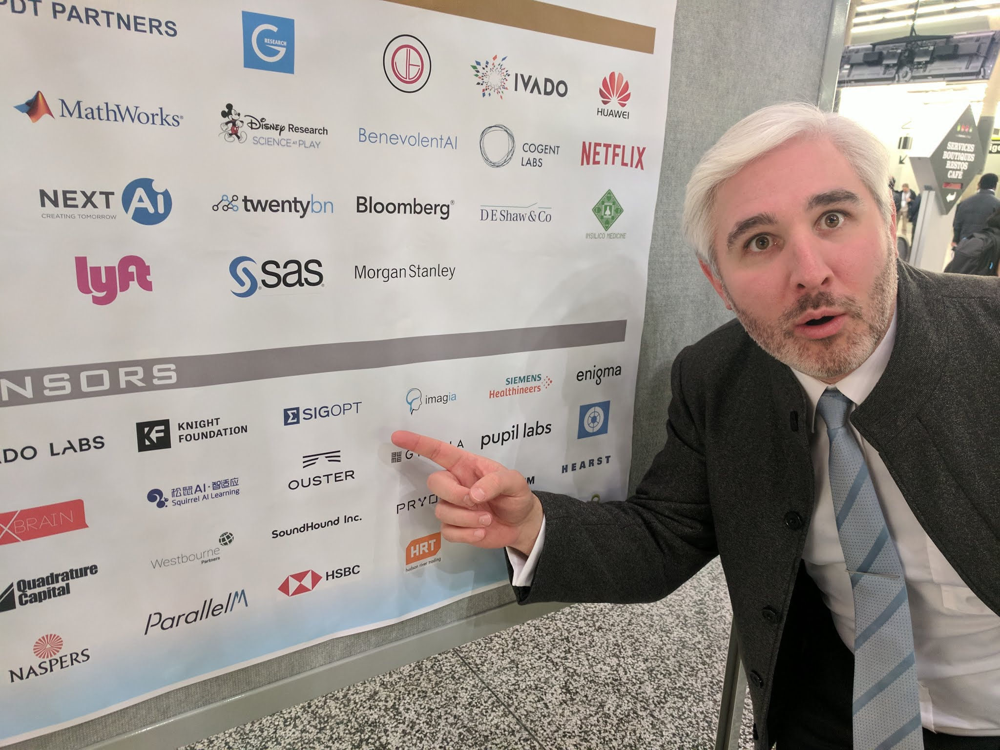

## Welcome

Hello everyone.  I am Mike McCourt, a [research engineer](https://sigopt.com/company/team/)
at [SigOpt](https://sigopt.com/company/).  This website is meant to compile all the research
that I have done into one location.  Previously, I have kept content at numerous sources, and
it finally became time to organize it.

### Picture

Everyone seems to love pictures, so I thought it best to put one in.  This was in Montreal at
the 2018 NIPS conference. This is a rare picture of myself that I actually enjoy.  I may add
more at some point.

### Professional History

[PDF CV](_docs/mccourt_cv_full.pdf)

#### Education

* Ph. D. in Applied Mathematics, Cornell University, 2013
* M. S. in Applied Mathematics, Cornell University, 2009
* B. S. in Applied Mathematics, Illinois Institute of Technology, 2003

#### Work Experience

* Research Engineer/Head of Research, SigOpt, 2015-present
* Visiting Assistant Professor, University of Colorado-Denver, 2013-2015
* Lab Grad Associate, Argonne National Laboratory, 2010-2013
* Instructor/Research Assistant Professor, Illinois Institute of Technology, 2010-2013

#### Books and Chapters

* **Stable likelihood computation for Gaussian random fields**
    * M. McCourt, G. Fasshauer, Recent
Applications of Harmonic Analysis to Function Spaces, Differential Equations, and Data Science, I.
Pesenson, Q. T. Le Gia, A. Mayeli, H. Mhaskar, D.-X. Zhou, Eds., 917-943, 2017.
[preprint](_docs/MccourtFasshauer15.pdf)
* **Kernel-based Approximation Methods Using Matlab**
    * G. Fasshauer, M. McCourt, World Scientific
Press, 2015. ISBN: 978-981-4630-14-6
[link](https://www.worldscientific.com/worldscibooks/10.1142/9335)

#### Articles and Proceedings

* _Discovering near-perfect broadband and broad angle antireflection surfaces for optoelectronics by
machine learning_
[workshop](https://ml4physicalsciences.github.io/files/NeurIPS_ML4PS_2019_41.pdf)
    * S. Haghanifar, M. McCourt, B. Cheng, J. Wuenschell, P. Ohodnicki, P. Leu, Optica, 2020.
    In Press
* _Practical Bayesian optimization over sets_
[preprint](https://arxiv.org/abs/1905.09780)
    * J. Kim, M. McCourt, T. You, S. Kim, S. Choi, Proceedings of the 37th International Conference
    on Machine Learning, 2020. In Press
* _Efficient rollout strategies for Bayesian optimization_
[preprint](https://arxiv.org/abs/2002.10539)
    * D. Bindel, E. Lee, B. Cheng, M. McCourt, D.
Eriksson, Proceedings of the Thirty-Sixth Conference on Uncertainty in Artificial Intelligence, 2020. In
Press.
* _On variable and random shape Gaussian interpolations_
[link](https://www.sciencedirect.com/science/article/abs/pii/S0096300320301284)
[preprint](_docs/VariableShape2020.pdf)
    * S. Chiu, L. Ling, M. McCourt, Applied
Mathematics and Computation, 377:125159, 2020.
* _Sampling humans for optimizing preferences in Coloring Artwork_
[workshop](https://arxiv.org/abs/1906.03813)
    * M. McCourt, I. Dewancker, ICML Workshop on Human in the Loop Learning, 2019.
* _Creating glasswing butterfly-inspired durable antifogging superomniphobic supertransmissive,
superclear nanostructured glass through Bayesian learning and optimization_
[link](https://pubs.rsc.org/en/content/articlelanding/2019/mh/c9mh00589g/unauth#!divAbstract)
[workshop 1](_docs/ICML_2019_Climate_workshop.pdf)
[workshop 2](_docs/ICML_2019_SDM_workshop.pdf)
    * S. Haghanifar, M.
McCourt, B. Cheng, J. Wuenschell, P. Ohodnicki, P. Leu, Materials Horizons, 6(8):1632-1642, 2019.
* _Anisotropic Weights for RBF-PU Interpolation with Subdomains of Variable Shapes_
[link](https://link.springer.com/chapter/10.1007/978-3-319-96415-7_6)
[preprint](_docs/pu_weights.pdf)
    * R. Cavoretto, A. De Rossi, G. Fasshauer, M. McCourt, E. Perracchione,
    In: Radu F., Kumar K., Berre I., Nordbotten J., Pop I. (eds) Numerical
    Mathematics and Advanced Applications ENUMATH 2017. ENUMATH 2017.
    Lecture Notes in Computational Science and Engineering, 126:93-101, 2019.
    Springer, Cham.
* _Practical Bayesian optimization in the presence of outliers_
[link](http://proceedings.mlr.press/v84/martinez-cantin18a.html)
    * R. Martinez-Cantin, K. Tee, M. McCourt,
Proceedings of the Twenty-First International Conference on Artificial Intelligence and Statistics,
PMLR 84:1722-1731, 2018.
* _An augmented MFS approach for brain activity reconstruction_
[link](https://www.sciencedirect.com/science/article/abs/pii/S0378475416302488)
[preprint](_docs/augmented_mfs_preprint.pdf)
    * G. Ala, G. Fasshauer, E. Francomano,
S. Ganci, M. McCourt, Mathematics and Computers in Simulation, 141:3-15, 2017.
* _A strategy for ranking optimization methods using multiple criteria_
[link](http://proceedings.mlr.press/v64/dewancker_strategy_2016.html)
    * I. Dewancker, M. McCourt, S.
Clark, P. Hayes, A. Johnson, G. Ke, JMLR Workshop and Conference Proceedings, 64:11-20, 2016.
* _A meshfree solver for the MEG forward problem_
[link](https://ieeexplore.ieee.org/abstract/document/7093445)
[preprint](_docs/tmag_preprint.pdf)
    * G. Ala, G. Fasshauer, E. Francomano, S. Ganci, M.
McCourt, IEEE Transactions on Magnetics, 51(3):1-4, 2015.
* _The method of fundamental solutions in solving coupled boundary value problems for M/EEG_
[link](https://epubs.siam.org/doi/abs/10.1137/13094921X)
[preprint](_docs/AlaFasshauerEtAl15.pdf)
    * G. Ala, G. Fasshauer, E. Francomano, S. Ganci, M. McCourt, SIAM Journal on Scientific Computing,
37(4):B570-B590, 2015.
* _Sparse matrix-matrix products executed through colorings_
[link](https://epubs.siam.org/doi/abs/10.1137/13093426X)
[preprint](_docs/MccourtSmithEtAl14.pdf)
    * M. McCourt, B. Smith, H. Zhang, SIAM
Journal on Matrix Analysis and Applications, 36(1):90-109, 2015.
* _An introduction to the Hilbert-Schmidt SVD using iterated Brownian bridge kernels_
[link](https://link.springer.com/article/10.1007/s11075-014-9850-z)
[preprint](_docs/CavorettoFasshauerEtAl14.pdf)
    * R. Cavoretto, G. Fasshauer, M. McCourt, Numerical Algorithms, 68(2):393-422, 2015.
* _Multiphysics simulations: Challenges and opportunities_
[link](https://journals.sagepub.com/doi/abs/10.1177/1094342012468181)
    * D. Keyes et al, The International Journal of
High Performance Computing Applications, 27(1), 4-83. 2013.
* _Using Gaussian eigenfunctions to solve boundary value problems_
[link](https://www.cambridge.org/core/journals/advances-in-applied-mathematics-and-mechanics/article/using-gaussian-eigenfunctions-to-solve-boundary-value-problems/863BC316BF60AB0BD5F72DA333BEDB7F)
[preprint](_docs/Mccourt13.pdf)
    * M. McCourt, Advances in Applied Mathematics and Mechanics, 5:569-594, 2013.
* _Improving parallel scalability for edge plasma transport simulations with neutral gas species_
[link](http://iopscience.iop.org/1749-4699/5/1/014012/article)
    * M. McCourt, T. D. Rognlien, H. Zhang, L. C. McInnes, Computational Science and Discovery, 5:014012, 2012.
* _Stable evaluation of Gaussian RBF interpolants_
[link](http://epubs.siam.org/doi/abs/10.1137/110824784)
[preprint](_docs/FasshauerMccourt12.pdf)
    * G. Fasshauer, M. McCourt, SIAM Journal on Scientific Computing, 34(2):A737-A762, 2012.
* _Pseudorandom numbers for conformal measures_
[link](http://www.tandfonline.com/doi/abs/10.1080/14689360903002019#.VItSJzHF-OY)
[preprint](_docs/DenkerDuanEtAl09.pdf)
    * M. Denker, J. Duan, M. McCourt, Dynamical Systems, 24(4):439-457, 2009.
* _Spectral methods for resolving spike dynamics in the Gierer-Meinhardt model_
[link](http://www.global-sci.com/issue/contents/3/issue3.html)
    * M. McCourt, N. Dovidio, M. Gilbert, Communications in Computational Physics, 3:659-678, 2008.

#### Patents

* _Systems and methods for implementing an intelligent machine learning optimization platform for
multiple tuning criteria_                      
    * B. Cheng, O. Kim, M. McCourt, P. Hayes, S. Clark
        * [10528891](http://patft.uspto.gov/netacgi/nph-Parser?Sect1=PTO1&Sect2=HITOFF&d=PALL&p=1&u=%2Fnetahtml%2FPTO%2Fsrchnum.htm&r=1&f=G&l=50&s1=10528891.PN.&OS=PN/10528891&RS=PN/10528891)
        * [10558934](http://patft.uspto.gov/netacgi/nph-Parser?Sect1=PTO1&Sect2=HITOFF&d=PALL&p=1&u=%2Fnetahtml%2FPTO%2Fsrchnum.htm&r=1&f=G&l=50&s1=10558934.PN.&OS=PN/10558934&RS=PN/10558934)
        * [10558934](http://patft.uspto.gov/netacgi/nph-Parser?Sect1=PTO1&Sect2=HITOFF&d=PALL&p=1&u=%2Fnetahtml%2FPTO%2Fsrchnum.htm&r=1&f=G&l=50&s1=10558934.PN.&OS=PN/10558934&RS=PN/10558934)
* _Systems and methods implementing an intelligent machine learning tuning system providing multiple
tuned hyperparameter solutions_
    * K. Tee, M. McCourt, P. Hayes, S. Clark
        * US20190156229A1, 2019-05-23, Pending
* _Systems and methods implementing an intelligent optimization platform_
    * P. Hayes, M. McCourt, A. Johnson, G. Ke, S. Clark
        * [10217061](http://patft.uspto.gov/netacgi/nph-Parser?Sect1=PTO1&Sect2=HITOFF&d=PALL&p=1&u=%2Fnetahtml%2FPTO%2Fsrchnum.htm&r=1&f=G&l=50&s1=10217061.PN.&OS=PN/10217061&RS=PN/10217061)
        * [10607159](http://patft.uspto.gov/netacgi/nph-Parser?Sect1=PTO1&Sect2=HITOFF&d=PALL&p=1&u=%2Fnetahtml%2FPTO%2Fsrchnum.htm&r=1&f=G&l=50&s1=10607159.PN.&OS=PN/10607159&RS=PN/10607159)
* _Systems and methods for an accelerated tuning of hyperparameters of a model using a machine
learning-based tuning service_
    * M. McCourt, B. Hsu, P. Hayes, S. Clark
        * US20200019888A1, 2020-01-16, Pending
        
#### Software Libraries

* [GaussQR](https://github.com/mikemccourt/gaussqr)
    * Matlab library for stably computing with kernel methods
    (part of [textbook](https://www.worldscientific.com/worldscibooks/10.1142/9335))
    * One day, when I find the time, I will move this to Python
* [QMCPy](https://github.com/QMCSoftware/QMCSoftware)
    * Python library for providing and developing Quasi-Monte Carlo methods
* [PrefOpt](https://github.com/prefopt/prefopt)
    * Python library for conducting optimization of most-preferred (non-numeric) metrics

### About me (in words)

#### Growing Up

I was born and raised in northeast Ohio, which explains why I am a fan of the Cavaliers and
the Indians; much of my family is from Pittsburgh which explains why I love the Steelers (I
consider myself a fair-weather Penguins fan).  My parents, Laurel and Jason, and my brother,
Kevin, still live in the area, though Mom and Dad spend much of the year in Florida (which is
somewhere that I would much rather visit).

In 2003 I moved to Chicago for my undergraduate time at the Illinois Institute of Technology.
I absolutely love Chicago and the great friends and professors that I met during that time.
The applied mathematics department there is a great place to learn and engage with brilliant
minds, though many of the professors I met have moved on in the past 17 years.  Even so, I
stay in touch with many and continue to collaborate with some, including recently on the
[QMCPy](https://github.com/QMCSoftware/QMCSoftware) project.

I did grad school at Cornell University in 2007 under
[Charlie Van Loan](http://www.cs.cornell.edu/cv/); Dr. Van Loan taught me
a lot, though I did not always understand it at the time.  While I did very much enjoy learning
from Dr. Van Loan and the numerous other outstanding professors at Cornell, I did not much enjoy
living in Cornell --- fortunately, the generous administration at Cornell and Dr. Van Loan
were flexible and kind enough to let me pursue my Ph. D. research at Argonne National Labs.

#### Moving Around

From 2010-2013, I was at Argonne's math and computer science department as a graduate student,
working with [Lois Curfman McInnes](https://press3.mcs.anl.gov/curfman/) and
[Hong Zhang](https://www.mcs.anl.gov/~hzhang/).  I worked on computational mathematics tools
for running multiphysics simulations; my
[thesis](https://ecommons.cornell.edu/bitstream/handle/1813/33784/mjm458.pdf?sequence=1) is
available online, though I think
[this](https://journals.sagepub.com/doi/full/10.1177/1094342012468181)
is an infinitely better introduction to the topic.
I also was fortunate enough to teach some classes at
IIT, which helped balance out my minimal time physically being (and teaching) at Cornell.  I
really want to thank everyone at Cornell, Argonne and IIT who supported me in my unorthodox
path through graduate school.

In fall 2013 I took a postdoc position at University of Colorado-Denver, where I was given time
to write a book,
[Kernel-based Approximation Methods Using Matlab](https://www.worldscientific.com/worldscibooks/10.1142/9335),
along with [Gregory Fasshauer](https://ams.mines.edu/gfasshauer/) (who I have known since
my time as an undergrad at IIT).  As part of my time at Denver, the department sent me to Beijing
to teach at our partner school, 中国农业大学
([China Agricultural University](http://www.ucdenver.edu/academics/internationalprograms/oia/icb/Pages/default.aspx));
that experience was one of the best of my life and I thank both universities for giving me the
opportunity to study and teach in Beijing.

This is as good a time as any to mention that I have spent numerous chunks of my life in
Hong Kong, first as a [undergraduate](https://archive.siam.org/news/news.php?id=1044),
then as a grad student.  I go back as often as possible, most recently in the professional
context to participate in the Johns Hopkins [CTY program](https://cty.jhu.edu/summer/international/)
at HKU.  I think of Hong Kong as my second home and my favorite place in the world;
[this picture](_images/reu_group.jpg) recoalls one of my fondest memories of my time there.

#### New Adventures

I am an academic at heart, but I have been thoroughly enjoying the world of industry since 2015
when I joined the research team at SigOpt in San Francisco.  SigOpt is a company created to
"Empower the world's experts" by providing them software and guidance to perform an adaptive
design of experiments for identifying high performing strategies.  Our customers come from
a variety of communities, including tech companies, financial companies, government institutions,
national labs, and universities
(we have a free [academic program](https://sigopt.com/solution/academia/)).

I absolutely love working at SigOpt.  This has been an incredible opportunity for me to explore
the world of industry while supported by brilliant teammates.  When I arrived, I was not an
ML expert, and I still would not call myself an ML expert, but I have learned about the
beautiful interplay between math and statistics and learning theory and practical situations
which leads to enterprise-grade software.  I cannot thank enough Scott (CEO) and Patrick (CTO)
for bringing me on board; the next 5 years at SigOpt will be even better than the first 5.
